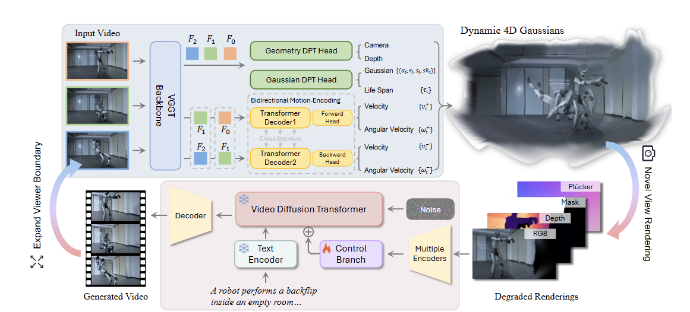

# NeoVerse 工作

> Input -> VGGT -> 4DGS -> 动态+静态 -> Gauss世界 -> 条件（分离动静，退化模拟）-> 多模态退化条件 -> Control Branch 注入条件 -> 扩散模型 -> 高质量视频 （再Input）

1. 与传统VGGT的区别

   在Phase1 4DGS重建过程中，相较于传统的VGGT加入了两个预测头。

2. from README
   inference.py: 实现Gauss重建的推理任务，输入：

   - 视频 → 张量帧（load_video, L232）：原始 mp4/图片 → 抽 num_frames(默认81) 帧，按center_crop/resize 统一到 560×336 的 PIL 图列表 images。
   - 帧 → 模型输入 views（generate_video, L16–26）：img: [1, T, 3, H, W]（每帧 to_tensor），我们的重建过程：is_static = False, is_target = False(全为源视角)
   - views → 4D 高斯 + 相机参数（reconstructor, L32–43），WorldMirror/VGGT 前馈一次（use_motion=False），输出 predictions：
       - splats → 4D 高斯场（场景的几何/外观/不透明度，动态场景含运动属性）
       - rendered_intrinsics → 内参 K [T,3,3]
       - rendered_extrinsics → 输入相机外参 input_cam2world [T,4,4]
       - rendered_timestamps → 时间戳

## Neoverse 的多视角gauss重建

实现说明

> 把自车 6 路环视相机视频，融合成一个时序对齐的 4DGS 场景，并渲染成**无人机视角行驶环境视频**（自车用占位框）。接受原始高斯光栅边缘模糊（允许空洞）。

###  NeoVerse 的复用关系

- 复用 NeoVerse 原生能力：Reconstructor（WorldMirror 前馈 4DGS）、gsplat 光栅化器、`Gaussians` 数据结构、几何工具 `depth_to_world_coords_points`、`save_gs_ply`、`save_video`、`ModelManager`、bfloat16 autocast。
- 新增：跨相机的刚性 rig 锚定 + 地面 leveling + 米制对齐融合（NeoVerse 原设计面向单目序列，无环视多相机融合能力），以及无人机轨迹渲染与占位框。

### 核心难点与设计动机

WorldMirror 没有 bundle adjustment，跨视一致性只靠图像间光度对应。环视相机相邻视角重叠 <10%（对角线≈0），6 路同时喂、让模型回归到一个世界系失败 得到 6 片散开的曲面壳。不让模型对齐相机，改为：逐相机各自重建（单相机时序重叠 100%，模型很稳）→ 用已知的 nuScenes rig 外参把 6 片摆进同一自车系 ，用地面统一每路的尺度与水平。

### 设计：rig 锚定 与 leveling

rig 锚定（把 6 片摆到正确位置）

把 6 个相机位置和角度是出厂定死的。所以我们不去猜相机之间的相对关（系模型在环视薄重叠下也猜不准），而是直接查 nuScenes 的"出厂安装表"（rig 外参），
把每个相机各自重建出来的那一片场景，按照出厂位置和角度，卡到统一的车身坐标系上。

- 实现上：每片乘一个旋转 + 平移，就从相机自己的坐标系搬到车身坐标系。

leveling（把每片摆平 + 调到真实大小）

每个相机重建出的那片，有两个毛病：(1) 可能是歪的，地面不水平；(2) 大小不对，单目深度没有绝对尺度，整体可能放大或缩小。
解决办法是在每片里找出"地面"这个平面，然后：

- 摆平（leveling）：像把一张斜放的桌布捋平——把地面的法线转到竖直朝上（+z）。
- 定尺度：假设相机离地约 1.5 m；在重建里量出"相机到地面"的距离，两者一比就得到放大倍数，把整片缩放到真实米制。

6 片都这样处理后，地面全部落到同一水平面 z=0、大小一致。

### 实现

**① nuScenes 初始数据 → rig 外参矩阵**

```python
# 每路：(在车身系下的安装位置 [x前,y左,z上] 米, 安装姿态四元数 [w,x,y,z])
# 车身系：x 前、y 左、z 上，原点≈地面；相机系：OpenCV 光学系(右-下-前)
# 注意：平移的 z 分量就是该相机的"离地安装高度"
NUSCENES_RIG = {
    "cam_front":       ([1.70079, 0.01595, 1.51096], [0.49980, -0.50303, 0.49978, -0.49737]),
    "cam_front_right": ([1.55085, -0.49340, 1.49575], [0.20603, -0.20269, 0.68245, -0.67136]),
    ...  # 其余 4 路同理
}

def build_rig():
    """把上表变成 {视角: (T_车身←相机 [4x4], 安装高度)}"""
    rig = {}
    for view, (trans, quat_wxyz) in NUSCENES_RIG.items():
        w, x, y, z = quat_wxyz
        R = Rotation.from_quat([x, y, z, w]).as_matrix()   # scipy 用 xyzw 顺序
        T = np.eye(4, dtype=np.float32)
        T[:3, :3] = R          # 相机相对车身的朝向
        T[:3, 3]  = trans      # 相机相对车身的位置
        rig[view] = (T, float(trans[2]))   # 第二项=离地高度，给 leveling 定尺度用
    return rig
```

**② leveling + 定尺度，在车身系里找地面**

```python
def level_and_scale(pts_recon, R_rig, t_rig, cam_center, known_h,
                    thresh_frac=0.02, n_iter=400, min_pts=200):
    """在车身系里拟合地面，返回 (尺度 s, 摆平旋转 R_lev)。拟合不可靠时返回 (None, 单位阵)。"""
    # 先用"单位尺度"把该相机的点临时摆上 rig → 进入车身系（此时已知"上"=+z）
    p1 = pts_recon @ R_rig.T + t_rig
    # 只保留相机下方的点（地面在脚下），排除天空/上方
    below = p1[:, 2] < cam_center[2]
    cand = p1[below] if int(below.sum()) >= min_pts else p1
    if cand.shape[0] < min_pts:
        return None, np.eye(3, dtype=np.float32)

    thresh = thresh_frac * np.median(np.linalg.norm(cand - cand.mean(0), axis=1))  # 自适应内点阈值
    up = np.array([0.0, 0.0, 1.0])
    best_inl, best = 0, None
    for _ in range(n_iter):                              # RANSAC：随机取 3 点定平面，找内点最多的
        tri = cand[np.random.choice(cand.shape[0], 3, replace=False)]
        nrm = np.cross(tri[1] - tri[0], tri[2] - tri[0])
        ln = np.linalg.norm(nrm)
        if ln < 1e-8:
            continue
        nrm = nrm / ln
        if abs(nrm @ up) < 0.85:                         # 只接受近水平面 → 排除墙面/车头
            continue
        d = -nrm @ tri[0]
        inl = int((np.abs(cand @ nrm + d) < thresh).sum())
        if inl > best_inl:
            best_inl, best = inl, (nrm, d)
    if best is None or best_inl < min_pts:
        return None, np.eye(3, dtype=np.float32)

    nrm, d = best
    if nrm[2] < 0:                                       # 法线统一朝上
        nrm, d = -nrm, -d
    dist = abs(nrm @ cam_center + d)                     # 相机中心到地面的垂直距离（重建单位）
    if dist < 1e-6:
        return None, np.eye(3, dtype=np.float32)
    s = float(known_h / dist)                            # 真实高度 / 重建距离 = 放大倍数（变米制）
    R_lev = rotation_align(nrm, up)                      # 把地面法线转到 +z 的旋转（摆平）
    return s, R_lev
```

**③ Phase A/B：逐相机重建 → 合成一个相似变换搬进车身系**

```python
for i, view in enumerate(RING_ORDER):
    # Phase A: 该相机单独做 4D 重建（这部分用 NeoVerse 原生 reconstructor）---
    pred = reconstructor(views, is_inference=True, use_motion=True)
    C = pred["rendered_extrinsics"][0, mid]      # 中间帧相机位姿 c2w
    C_inv = np.linalg.inv(C)                      # = w2c，把点搬到"该相机光学系"(相机落原点)
    Te, known_h = rig[view]                       # 出厂 rig：相机→车身 的外参 + 离地高度
    R_ec, t_ec = Te[:3, :3], Te[:3, 3]
    R_wc, t_wc = C_inv[:3, :3], C_inv[:3, 3]
    R_rig = R_ec @ R_wc                           # 单位尺度下"重建系→车身系"的旋转
    t_rig = R_ec @ t_wc + t_ec

    # 在车身系里拟合地面，拿到尺度 s 与摆平旋转 R_lev
    pts, mask = unproject_frame(pred, mid, device)
    s, R_lev = level_and_scale(pts[mask].cpu().numpy(), R_rig, t_rig, t_ec, known_h)
    # （拟合失败的相机，后面用其余相机尺度的中位数回填）

# Phase B: 把每片高斯按一个相似变换 (s, R_total, t_total) 搬进车身系 ---
for r in recons:
    s, R_lev = r["scale"], r["R_lev"]
    R_ec, t_ec, R_wc, t_wc = r["R_ec"], r["t_ec"], r["R_wc"], r["t_wc"]
    # 复合公式：先 C_inv 进光学系 → 乘 rig 上车身 → 再 R_lev 摆平、s 缩放
    R_total = R_lev @ R_ec @ R_wc                 # 总旋转
    t_total = s * (R_lev @ (R_ec @ t_wc)) + t_ec  # 总平移
    for g in r["gaussians"]:
        transform_gaussians_(g, s, R_total, t_total, device)   # 作用到该片每个高斯
        # 自检：相机中心恒落到安装位 t_ec，与 s、R_lev 无关 → 6 个相机围着车身正确排布
```

**④ 相似变换如何作用到一个高斯（位置/尺度/朝向/速度一起变）**

```python
def transform_gaussians_(g, s, R_np, t_np, device):
    R = torch.tensor(R_np, ...); t = torch.tensor(t_np, ...)
    g.means  = s * (g.means @ R.T) + t            # 位置：缩放 + 旋转 + 平移
    g.scales = g.scales * s                        # 高斯大小：随尺度缩放
    # 朝向：新四元数 = R ⊗ 旧四元数（把椭球旋到新方向）
    g.rotations = (Rotation.from_matrix(R_np) * Rotation.from_quat(旧四元数)).as_quat()
    for attr in ("forward_vel", "backward_vel"):   # 运动速度：只旋转+缩放，不平移
        v = getattr(g, attr, None)
        if v is not None:
            setattr(g, attr, s * (v @ R.T))
    return g
```

> 渲染阶段（Phase C）：用 `cam_front` 的相似变换把前相机轨迹映射成自车路径，无人机在其"后上方"绕飞，
> 用 `reconstructor.gs_renderer.rasterizer` 在进展时刻 `tau` 光栅化，`save_video` 写出。

### PLY 产物含义

`dump_fused_ply` 导出**融合后场景的快照**（每个高斯取其基准时刻），坐标系 = **自车系、米制、地面 z=0**。

- **每个点 = 一个高斯 = 某相机某帧某像素的反投影**（WorldMirror 每像素一高斯），携带位置 / 颜色(SH DC→`f_dc`) / 不透明度 / 尺度 / 朝向。
- **俯视图**：6 个相机扇区呈放射状叶瓣；叶瓣间的**楔形黑缝 = 环视薄重叠的角度盲区**；中心洞 = 自车正下方无相机覆盖。
- **侧视图**：经 leveling 后是贴近 z=0 的扁平地面 + 其上直立内容；残留轻微上翘 = 单目前馈深度的远端不确定性
- **检验用途**：验证 6 片是否共地面(z=0)、朝向是否正确(前+x / 后−x / 左+y / 右−y)、尺度是否一致(物体大小匹配)。

使用这个网址：https://superspl.at/editor

模拟得到侧视图和俯视图


### CLI 参数意义

| 参数 | 默认 | 含义 |
|---|---|---|
| `--res_dir` | `res` | 6 路视频目录（文件名须为 `dreamforge_sequence_{view}.mp4`，**文件名决定该路用哪套 rig 外参**） |
| `--reconstructor_path` | … | WorldMirror 权重路径 |
| `--output_path` | `outputs/surround_drone.mp4` | 输出视频路径 |
| `--num_input_frames` | 49 | 每路喂给重建器的连续帧数 T（↑覆盖更广但显存↑） |
| `--start_frame` | 0 | 连续窗起始帧 |
| `--frame_stride` | 1 | 帧间隔（1=真连续；保证帧间线性运动假设） |
| `--width / --height` | 560 / 336 | 输入与渲染分辨率 |
| `--num_frames` | 97 | 输出视频帧数（与 T 解耦，↑=更长更顺） |
| `--fps` | 16 | 输出帧率 |
| `--ground_thresh_frac` | 0.02 | 地面 RANSAC 内点阈值（占场景尺度比例） |
| `--no_ground_scale` | off | 跳过地面拟合，单位尺度（调试） |
| `--dump_ply` | None | 同时导出融合 .ply（SuperSplat 检验） |
| `--ply_max_points` | 2e6 | PLY 下采样上限 |
| `--height_off` | 14 | 无人机离地高度 [m]（绝对） |
| `--back_off` | 10 | 无人机在自车后方距离 [m]（绝对） |
| `--look_ahead` | 2 | 注视点在自车前方地面的距离 [m] |
| `--max_range` | 0(关) | 剔除离自车 XY 半径 >R[m] 的远端弯曲场，收紧缝隙 |
| `--freeze_time` | off | 整段锁定 mid 时刻渲染，消除壳间时序漂移 |
| `--ground_fill` | off | z=0 加平整路面圆盘，补中心洞/接缝 |
| `--ground_radius` | 30 | 地面圆盘半径 [m] |
| `--ground_spacing` | 0.4 | 地面圆盘点间距 [m] |
| `--car` | off | 渲染红色线框自车占位 |
| `--car_len / wid / hgt` | 4.5 / 2.0 / 1.6 | 占位框尺寸 [m] |

### 当前局限

单目 2.5D 壳 + 跳过扩散修补 → 楔形角缝与中心洞暂时无法根除（任何相机都没拍到的盲区）；远端有残留弯曲。可达到的上限是"斜视跟拍下视觉可接受的带洞环境视频"

### 命令

```bash
CUDA_VISIBLE_DEVICES=3 python fuse_surround_drone.py \
    --res_dir res \
    --reconstructor_path /mnt/ssd1/wzq_models/NeoVerse/reconstructor.ckpt \
    --output_path outputs/surround_drone_v4.mp4 \
    --dump_ply outputs/surround_fused_v4.ply \
    --num_input_frames 49 --num_frames 97 \
    --car --max_range 25 --freeze_time \
    --height_off 36 --back_off 36 --look_ahead 0
```
